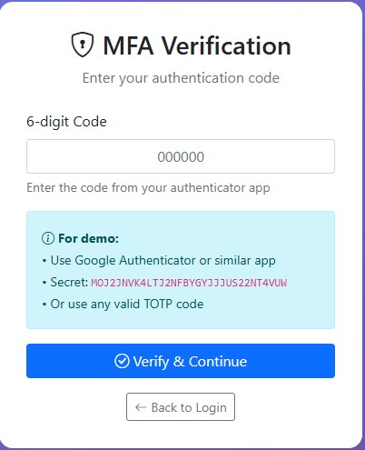
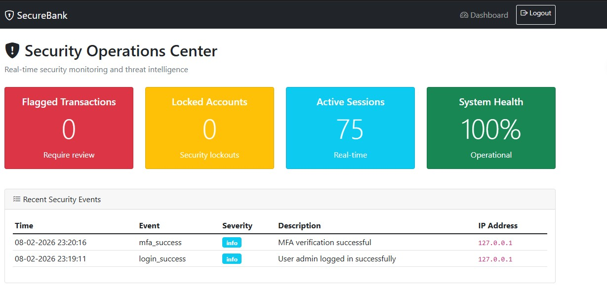

<h1 align="center"> 🏦 Banking Security Platform 🔐 </h1>

A secure banking application built with Flask and SQLAlchemy, demonstrating best practices for web security, user authentication, and data integrity. This platform includes features like secure user management, transaction processing, fraud detection, and a security dashboard, with all timestamps correctly handled for the IST timezone.

## 📸 Screenshots

| Home Screen | Multi-Factor Authentication | Security Dashboard |
| :---: | :---: | :---: |
|  |  |  |

## ✨ Features

- **Secure User Authentication**: Robust login and registration system with password hashing (`Werkzeug`) and session management.
- **Multi-Factor Authentication (MFA)**: Time-based One-Time Password (TOTP) support using `pyotp` for enhanced security.
- **Transaction Management**: Securely create and view transactions between accounts.
- **Fraud Detection**: A simulated fraud detection system to flag suspicious transactions based on a scoring model.
- **Security Dashboard**: A real-time dashboard for administrators to monitor security events, flagged transactions, and locked accounts.
- **Timezone Correction**: All timestamps are stored in UTC in the database and correctly converted to Indian Standard Time (IST, UTC+5:30) in the user interface using a custom Jinja2 filter.
- **Role-Based Access**: Differentiates between regular customers and administrators with different views and permissions.
- **Account Security**: Features like login attempt tracking and account lockout to prevent brute-force attacks.

## 💻 Tech Stack

- **Backend**: Python, Flask
- **Database**: SQLAlchemy with SQLite
- **Authentication**: Flask-Login
- **Frontend**: Jinja2, HTML, CSS, JavaScript
- **Timezone Handling**: `pytz`
- **Security**: `Werkzeug` for password hashing, `bleach` for sanitizing input.

## 📂 Project Structure

```
.
├── app.py                  # Main Flask application file, routes
├── auth.py                 # Authentication logic
├── config.py               # Application configuration
├── fraud_detection.py      # Fraud detection logic
├── models.py               # SQLAlchemy database models
├── timezone_utils.py       # UTC to IST timezone conversion utility
├── requirements.txt        # Python dependencies
├── .gitignore              # Files to be ignored by Git
├── static/                 # CSS and JavaScript files
├── templates/              # HTML templates
└── instance/               # SQLite database file (ignored by git)
```

## 🚀 Setup and Installation

Follow these steps to get the application running locally.

**1. Clone the repository:**
```bash
git clone https://github.com/your-username/banking-security-platform.git
cd banking-security-platform
```

**2. Create and activate a virtual environment:**

- **Linux/macOS:**
  ```bash
  python3 -m venv venv
  source venv/bin/activate
  ```
- **Windows:**
  ```bash
  python -m venv venv
  .\venv\Scripts\activate
  ```

**3. Install the dependencies:**
```bash
pip install -r requirements.txt
```

**4. Initialize the database:**
Run the following commands in a Python shell to create the database tables.
```bash
python
>>> from app import db, app
>>> with app.app_context():
...     db.create_all()
...
>>> exit()
```

## ▶️ Usage

To start the Flask development server, run the following command from the project's root directory:

```bash
flask run
```
Or directly run the main application file:
```bash
python app.py
```
The application will be available at `http://127.0.0.1:5000`.

## 🌐 Live Demo

The application is deployed and available live: [Click Here](https://banking-security-platform.onrender.com/)

## 📄 License

This project is licensed under the MIT License. See the [LICENSE](LICENSE) file for details.


## 👤 Author

[LinkedIn](https://www.linkedin.com/in/kaif-tarasgar-0b5425326/) • [Twitter/X](https://x.com/Kaif_T_200)

# Made with ❤️ by Kaif Tarasgar

